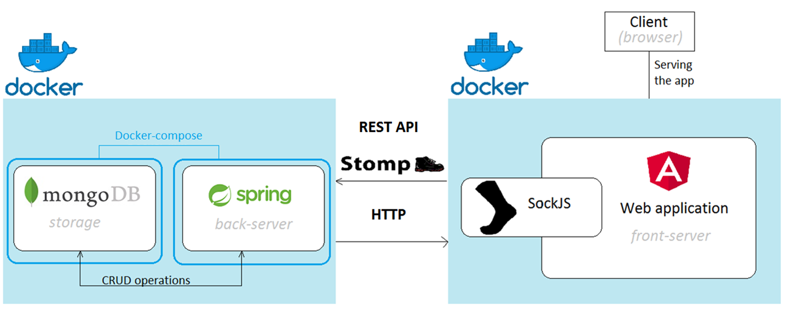
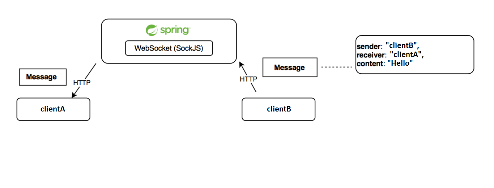

# Gitlogue

Project of participant Dell mentoring program.

## 1. Overview
Gitlogue - is client-server  web chat.

## 1.1 User's registration scenario

## 1.2 Message exchange scenario

## 2.1 Client part
Documentation of client part might be found [here](chat-client/README.md).

## 2.2 Server part
Documentation of client part might be found [here](chat-server/README.md).

